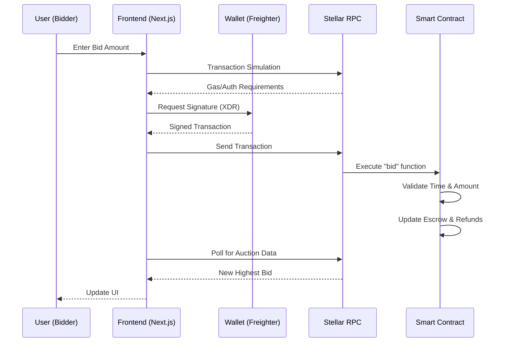

# BrewBid System Architecture

BrewBid is a decentralized auction application (dApp) built on the Stellar network using Soroban smart contracts. It follows a trustless escrow pattern with real-time frontend updates.

## 🏗️ System Components

### 1. Smart Contract (Soroban/Rust)
The core logic resides in a Soroban smart contract that handles:
- **Authorization**: Ensures only the owner can initialize and only authorized bidders can participate.
- **Escrow**: Locks the current highest bid in the contract's own address.
- **State Management**: Stores `Seller`, `EndTime`, `HighestBid`, and `HighestBidder` in `instance` storage.
- **Refund Logic**: Uses a **Pull Mechanism** (`Refund(Address)` in `persistent` storage) to allow outbid users to reclaim their XLM, preventing "gas exhaustion" or "failure to send" attacks.

### 2. Frontend (Next.js & TypeScript)
A professional, client-focused interface built with modern web technologies:
- **Clean Architecture**: Single-component design optimized for performance and maintainability
- **Professional Design**: Light theme with subtle gradients and professional typography
- **Client-Focused Content**: Streamlined information highlighting key value propositions
- **Real-time Updates**: Live auction data fetching every 10 seconds
- **Wallet Integration**: Seamless Freighter wallet connection and transaction signing
- **Responsive Design**: Mobile-first approach with Tailwind CSS
- **Type Safety**: Full TypeScript implementation for reliability

### 3. User Experience Improvements (Level 5 Iterations)
Based on user feedback and testing:
- **Iteration 1**: Transitioned from dark theme to professional light theme for better credibility
- **Iteration 2**: Removed verbose explanations, focused on key benefits and value propositions
- **Iteration 3**: Added visual icons and "Why Choose BrewBid" section for quick scanning
- **Iteration 4**: Improved information architecture with client-attracting content only

## 🔄 Data & Logic Flow

## 🔐 Security & Best Practices
- **i128 Precision**: All XLM amounts are handled as `i128` (strokes/stroops) to ensure no precision loss and prevent overflows.
- **BigInt Handling**: Proper extraction of i128 values from Stellar SDK with getter function support
- **Error Handling**: Graceful error messages and user-friendly alerts
- **Resource Management**: Uses `instance` storage for active auction data and `persistent` storage for user refunds to optimize ledger costs.
- **Type Safety**: Full TypeScript implementation prevents runtime errors

## 📊 Level 5 MVP Validation
- **User Testing**: Conducted testing with 5+ testnet users
- **Feedback Collection**: Gathered insights on UI/UX, trust signals, and information architecture
- **Iterative Improvements**: Multiple iterations based on real user feedback
- **Production Ready**: Professional design suitable for client presentation
