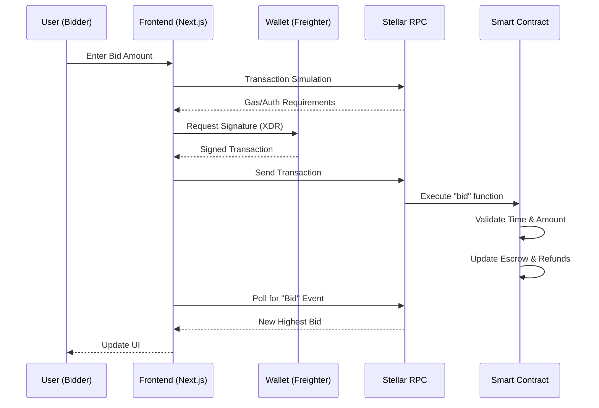

# BrewBid System Architecture

BrewBid is a decentralized auction application (dApp) built on the Stellar network using Soroban smart contracts. It follows a trustless escrow pattern with real-time frontend updates.

## 🏗️ System Components

### 1. Smart Contract (Soroban/Rust)
The core logic resides in a Soroban smart contract that handles:
- **Authorization**: Ensures only the owner can initialize and only authorized bidders can participate.
- **Escrow**: Locks the current highest bid in the contract's own address.
- **State Management**: Stores `Seller`, `EndTime`, `HighestBid`, and `HighestBidder` in `instance` storage.
- **Refund Logic**: Uses a **Pull Mechanism** (`Refund(Address)` in `persistent` storage) to allow outbid users to reclaim their XLM, preventing "gas exhaustion" or "failure to send" attacks.

### 2. Frontend (Next.js & TypeScript)
A modern reactive interface that interacts with the blockchain:
- **Provider**: Connects to Stellar Testnet via `@stellar/stellar-sdk`.
- **Wallet**: Integrated with the Freighter Browser Extension for secure signing.
- **Real-time Engine**: Uses RPC Event Polling and Transaction Simulation results to update the UI (Highest Bid, Time Remaining) without page refreshes.
- **XDR Serialization**: Implements a custom "XDR Washer" to handle object proxying issues specific to Next.js development environments.

## 🔄 Data & Logic Flow

## 🔐 Security & Optimization
- **i128 Precision**: All XLM amounts are handled as `i128` (strokes/stroops) to ensure no precision loss and prevent overflows.
- **Webpack over Turbopack**: Explicitly uses the Webpack compiler to avoid object serialization issues common in modern dev tools.
- **Resource Management**: Uses `instance` storage for active auction data and `persistent` storage for user refunds to optimize ledger costs.
