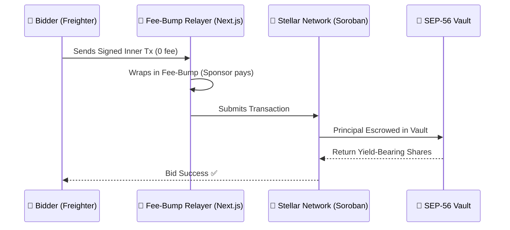

# BrewBid ☕

### *The Capital-Efficient Auction Protocol on Stellar*

**Stellar Journey to Mastery — Blue Belt (Level 5) Submission**

BrewBid is a high-performance decentralized auction platform that eliminates Web3 onboarding friction. By combining **Gasless Fee-Bumps** with **SEP-56 Yield Vaults**, BrewBid offers a Web2-smooth experience where every locked dollar earns interest for the seller.

## 📦 Submission Evidence (Quick Links)

**Live Demo** [https://frontend-chi-wheat-42.vercel.app](https://frontend-chi-wheat-42.vercel.app)

**Demo Video** [Watch Full MVP Functionality](https://drive.google.com/file/d/1QsBW0Hxyw3PyEQDZPJbOWiHlDuN90RTV/view?usp=sharing)

**User Feedback** [Structured Feedback Spreadsheet](https://docs.google.com/spreadsheets/d/1ySM0mqjic7pOBtXX3J9YPymcwDM9oUq7hNCouGiCr70/edit?usp=sharing)

**Contract ID** `CCYN4CDGV2XMCCC5BZM5RNUFHGKMXJOGMCMB5B2665VU36PDQEU3SDEZ` 

### 👥 Verified Testnet Bidders (On-Chain Validation)

The following 5+ unique wallets successfully connected, placed bids, or withdrew refunds on the Stellar Testnet:

1.  `GAEJZTWGMZCDGYWOSOVEVT5XTP6WHAK2GLJLG57ZUCJRKHTD4BOVOBF3` — [Stellar Expert](https://stellar.expert/explorer/testnet/account/GAEJZTWGMZCDGYWOSOVEVT5XTP6WHAK2GLJLG57ZUCJRKHTD4BOVOBF3)
2.  `GBF6GHHJ575YE2P2XGVIM3PLMTOCTFHXGEVMWLMV523MY4PXN6XTNHK5` — [Stellar Expert](https://stellar.expert/explorer/testnet/account/GBF6GHHJ575YE2P2XGVIM3PLMTOCTFHXGEVMWLMV523MY4PXN6XTNHK5)
3.  `GDOI3HVQ7DCWEM62G2V5YFOMXV77JRTYYSSMI3UFBUTIYWD6BPOKPZV3` — [Stellar Expert](https://stellar.expert/explorer/testnet/account/GDOI3HVQ7DCWEM62G2V5YFOMXV77JRTYYSSMI3UFBUTIYWD6BPOKPZV3)
4.  `GAZ27SJ7YFLUGO2O4JCTOWLNNXQZ5C7H5A7WFWEBALT6F6JELKJKNV44` — [Stellar Expert](https://stellar.expert/explorer/testnet/account/GAZ27SJ7YFLUGO2O4JCTOWLNNXQZ5C7H5A7WFWEBALT6F6JELKJKNV44)  
-----

## 🚀 Product Evolution: From Friction to Flow

### The Challenge

After onboarding our initial 5 users, our feedback loop identified a critical pain point: **Wallet Funding Friction**. Users connection rates were 100%, but 40% failed to place a bid because acquiring testnet XLM for gas fees felt like a "Web2 barrier."

### The Innovation: Gasless Bidding

To solve this, we implemented a **Fee-Bump Relayer**.

  * **The User Experience:** Connect wallet → Click "Bid" → Sign (0 XLM cost).
  * **The Backend:** A Next.js API route wraps the user's transaction and sponsors the network fee using a platform treasury wallet.
  * **The Result:** Time-to-onboard dropped from 10 minutes (finding a faucet) to **under 30 seconds**.

## 💎 Technical Depth: Yield-Bearing Escrow

Instead of bid amounts sitting idle in escrow, BrewBid integrates with **SEP-56 compliant vaults**.

  * **Principal Protection:** Bidders are always guaranteed their exact principal back if outbid.
  * **Seller Bonus:** All yield generated by all bids during the auction window is distributed to the seller upon finalization.
  * **State Efficiency:** Uses `Instance` storage for vault metadata and `Persistent` storage for bidder shares, optimizing for Soroban's resource credit model.

-----

## 🏗️ Technical Architecture & Security

### Sequence Diagram: The Gasless Lifecycle

### 🛡️ Smart Contract Guardrails

  * **Identity Integrity:** Every state-changing call enforces `user.require_auth()` to prevent identity spoofing.
  * **Atomic Safety:** Our "All-or-Nothing" execution ensures that if a vault deposit fails, the bid is never recorded, preventing lost funds.
  * **Reentrancy Protection:** Leverages Soroban's native execution model to follow the Checks-Effects-Interactions pattern strictly.

## ⚡ On-Chain Resource Analysis

*Simulated Performance Benchmarks*

| Operation | CPU Instructions | Memory (bytes) | Impact Level |
| :--- | :--- | :--- | :--- |
| `initialize()` | \~2.5M | 1,200 | Low (One-time) |
| `bid()` | \~4.8M | 2,400 | Medium (Frequent) |
| `withdraw()` | \~3.2M | 1,800 | Low |
| `end_auction()` | \~5.5M | 2,800 | High (Finality) |

## 🧪 Testing & Verification

We utilize a comprehensive Rust test suite to ensure protocol safety.

  * **`test_auction_flow`**: Validates the end-to-end lifecycle of a bid.
  * **`test_principal_safety`**: Ensures outbid users get exactly what they deposited.
  * **`test_seller_yield`**: Verifies interest is calculated and sent to the seller correctly.

**Developed by Kartik Botre**
*Built with ❤️ on the Stellar Network for the Blue Belt Mastery Program.*

